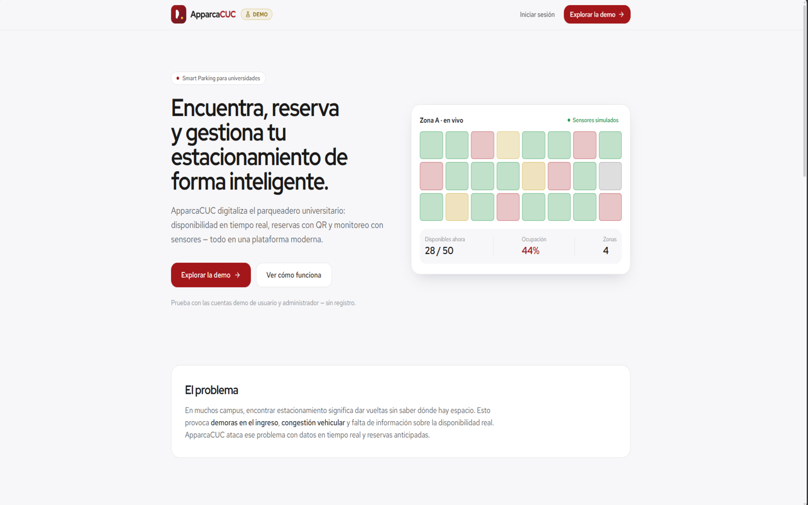
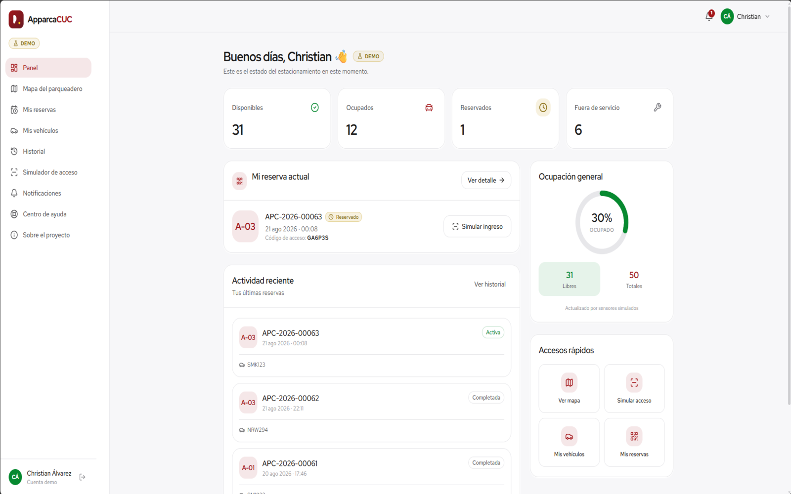
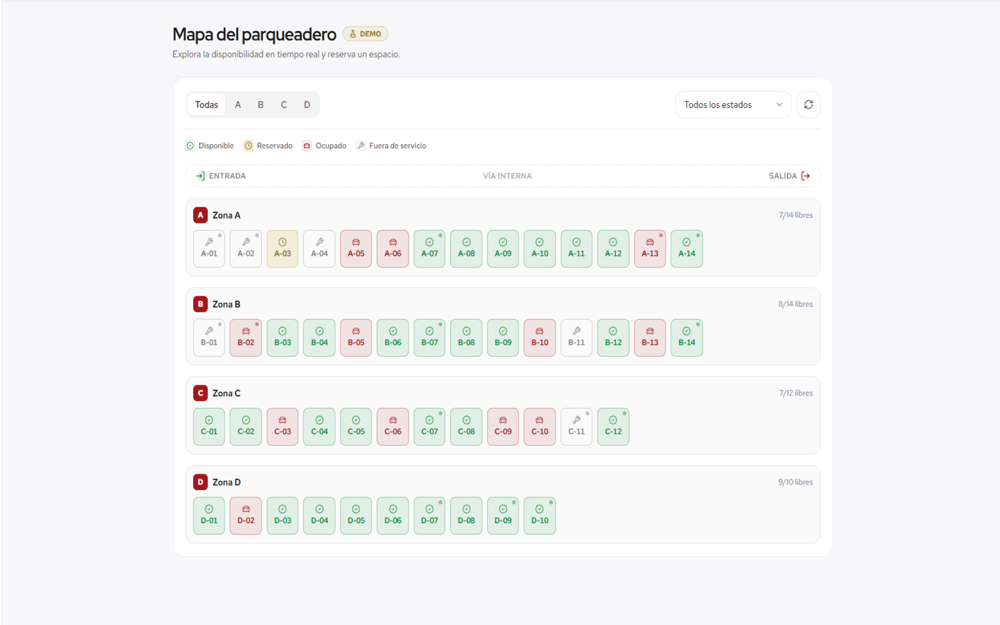
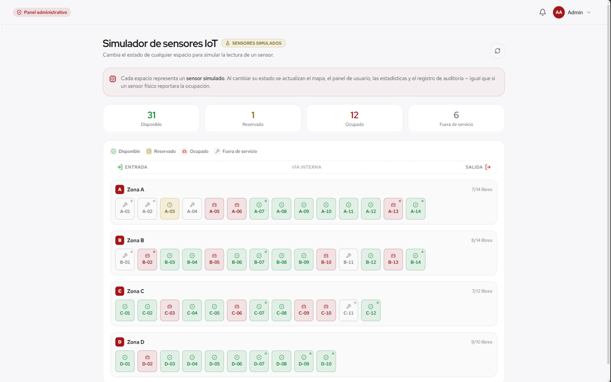

# 🅿️ ApparcaCUC — Smart Parking Management System

> **Demo académica · Proyecto de portafolio.** Solución de _Smart Parking_ para comunidades universitarias:
> disponibilidad en tiempo real, reservas con código QR, acceso simulado y simulación de sensores IoT.

<p>
  
  
  
  
  
</p>

> ⚠️ **Aviso.** Esta aplicación es una demostración funcional basada en un proyecto académico. **No representa un
> sistema oficial de la Universidad de la Costa (CUC) ni se encuentra conectada a sus sistemas institucionales.**
> Los datos (usuarios, vehículos, reservas) son ficticios. La integración con sensores físicos IoT y control de
> acceso físico **no** está implementada: se simula.

---

## 📸 Vista previa



|  |  |
| --- | --- |
|  |  |



## 🔑 Cuentas demo

| Rol           | Correo                     | Contraseña |
| ------------- | -------------------------- | ---------- |
| Usuario       | `demo@apparcacuc.com`      | `Demo123!` |
| Administrador | `admin@apparcacuc.com`     | `Admin123!`|

> En la pantalla de login hay botones de acceso rápido **“Usuario DEMO”** y **“Admin DEMO”** — no necesitas escribir credenciales.

---

## 🎯 El problema

En el entorno universitario, encontrar estacionamiento suele significar dar vueltas sin información. Esto provoca
**demoras en el ingreso**, **congestión vehicular** y una mala experiencia para estudiantes, docentes y personal.

## 💡 La solución

ApparcaCUC digitaliza la gestión del parqueadero:

- Disponibilidad **en tiempo real** por zona y espacio.
- **Reservas** anticipadas con código de reserva y **pase de acceso QR**.
- **Simulador de acceso** que valida el QR (ingreso/salida) como lo haría una barrera.
- **Simulación de sensores IoT** desde el panel administrativo.
- **Analíticas** de ocupación y uso.

## ✨ Funcionalidades

**Usuario**

- Dashboard con estado general y reserva activa
- Mapa interactivo del estacionamiento (semáforo de estados + accesibilidad)
- Reservas: crear, ver, cancelar, con QR
- Gestión de vehículos (CRUD)
- Historial con filtros y paginación
- Simulador de acceso (validación de QR: ingreso → ocupado, salida → disponible)
- Notificaciones
- Centro de ayuda (reportes de soporte)

**Administrador**

- Resumen con ocupación y actividad reciente (auditoría)
- Gestión de espacios (crear, editar, cambiar estado)
- **Simulador IoT** (cambiar el estado de cualquier “sensor”)
- Gestión de reservas (ver, cancelar)
- Gestión de usuarios
- Analíticas con gráficas (datos simulados claramente marcados)
- Gestión de reportes de soporte

---

## 🏗️ Arquitectura

```
Frontend (React SPA)  ──HTTP/JWT──▶  API REST (Express)  ──▶  MongoDB
     apps/web                            apps/api               (Atlas / in-memory)
```

El frontend **solicita**; el backend **decide**. Toda la autorización real vive en el servidor.

```
Proyecto-ApparcaCUC/
├── apps/
│   ├── api/                 # Backend — Express + TypeScript + Mongoose
│   │   └── src/
│   │       ├── config/      # env validado (zod) + conexión a BD
│   │       ├── models/      # User, Vehicle, ParkingSpace, Reservation, ...
│   │       ├── schemas/     # validación zod por endpoint
│   │       ├── middleware/  # auth, validación, sanitización, rate-limit, errores
│   │       ├── controllers/ # controladores REST
│   │       ├── services/    # lógica de negocio (reservas, parking/IoT, stats)
│   │       ├── routes/      # rutas REST
│   │       └── seed/        # generación de datos demo
│   └── web/                 # Frontend — React + Vite + Tailwind
│       └── src/
│           ├── components/  # ui, layout, parking, reservations, charts, brand
│           ├── pages/       # landing, auth, app (usuario), admin
│           ├── hooks/       # TanStack Query hooks
│           ├── context/     # AuthContext (JWT)
│           ├── lib/         # api (axios), queryClient, utils, formatos
│           └── config/      # tokens de estado de parqueo, navegación
├── README.md · SECURITY.md · ASSETS.md
```

## 🧰 Stack tecnológico

**Frontend:** React 18, TypeScript, Vite, Tailwind CSS, React Router, TanStack Query, Axios,
Recharts, lucide-react, qrcode.react, framer-motion, sonner, Red Hat Display/Text (self-hosted).

**Backend:** Node.js, Express, TypeScript, Mongoose, JWT (`jsonwebtoken`), bcryptjs, Zod, Helmet,
CORS, express-rate-limit. **Base de datos:** MongoDB (Atlas en producción; `mongodb-memory-server` en local).

---

## 🚀 Ejecutar localmente

**Requisitos:** Node.js ≥ 18.18 y npm. _No necesitas instalar MongoDB_: si no defines `MONGODB_URI`,
el backend arranca una base de datos **en memoria** y **siembra los datos demo automáticamente**.

```bash
# 1) Instala dependencias de ambas apps
npm run install:all

# 2) (opcional) crea los .env a partir de los ejemplos
cp apps/api/.env.example apps/api/.env
cp apps/web/.env.example apps/web/.env

# 3) Levanta backend (:4000) y frontend (:5173) a la vez
npm run dev
```

Abre **http://localhost:5173** e ingresa con una cuenta demo.

> El frontend hace proxy de `/api` a `http://localhost:4000` en desarrollo (configurado en `apps/web/vite.config.ts`).

### Scripts útiles

| Comando                | Descripción                                         |
| ---------------------- | --------------------------------------------------- |
| `npm run dev`          | Backend + frontend en paralelo                      |
| `npm run dev:api`      | Solo backend                                        |
| `npm run dev:web`      | Solo frontend                                       |
| `npm run seed`         | Re-siembra la BD (útil con MongoDB Atlas/persistente)|
| `npm run build`        | Compila backend y frontend para producción          |

---

## 🔐 Variables de entorno

**`apps/api/.env`**

| Variable             | Descripción                                                                 |
| -------------------- | --------------------------------------------------------------------------- |
| `NODE_ENV`           | `development` \| `production`                                               |
| `PORT`               | Puerto de la API (por defecto `4000`)                                       |
| `CLIENT_URL`         | Origen(es) permitidos por CORS (coma-separados)                            |
| `MONGODB_URI`        | Cadena de conexión. **Vacía en local** → MongoDB en memoria.               |
| `JWT_SECRET`         | Secreto para firmar los JWT (largo y aleatorio en producción)              |
| `JWT_EXPIRES_IN`     | Expiración del token (p. ej. `7d`)                                          |
| `SEED_ON_START`      | Sembrar datos demo si la BD está vacía (`true`/`false`)                     |

**`apps/web/.env`**

| Variable        | Descripción                                                                 |
| --------------- | --------------------------------------------------------------------------- |
| `VITE_API_URL`  | URL de la API en producción (p. ej. `https://…/api`). Vacía en local.       |

> ⚠️ Las variables `VITE_*` **terminan en el bundle público**. Nunca pongas secretos ahí.

---

## ☁️ Despliegue (opcional)

- **Frontend → Vercel / Netlify:** _root directory_ `apps/web`, build `npm run build`, output `dist`.
  Define `VITE_API_URL` con la URL pública de la API. (`vercel.json` y `_redirects` ya manejan el ruteo SPA.)
- **Backend → Render / Railway:** _root directory_ `apps/api`, build `npm install && npm run build`,
  start `npm run start`. Define `MONGODB_URI`, `JWT_SECRET`, `CLIENT_URL` (= URL del frontend) y `NODE_ENV=production`.
- **Base de datos → MongoDB Atlas:** crea un clúster, un usuario y pega la cadena en `MONGODB_URI`.
  Ejecuta `npm run seed` una vez para poblar los datos demo.

---

## 🛡️ Seguridad

Prácticas aplicadas: JWT con expiración, hashing con bcrypt, autorización por rol en el servidor,
verificación de _ownership_, validación de entradas con Zod, sanitización anti–NoSQL-injection, Helmet,
CORS restringido, rate-limiting y manejo de errores sin fugas de _stack traces_.
Ver el reporte completo en [`SECURITY.md`](SECURITY.md).

## 🚧 Limitaciones actuales

- La integración con **sensores físicos IoT** no está implementada (se simula desde el panel admin).
- No hay conexión con sistemas institucionales ni **control de acceso físico** real.
- Los datos son **ficticios** y de demostración.

## 🔭 Futuras mejoras

- Integración real con sensores/gateways IoT (MQTT/HTTP).
- Notificaciones push y correo.
- Reservas recurrentes y tarifas.
- Pruebas automatizadas (unitarias y e2e) y CI/CD.
- Modo oscuro.

## 📄 Licencia y créditos

Proyecto de portafolio con fines educativos. Basado en el proyecto de aula **ApparcaCUC**
(Christian Álvarez, Fernando Ahumada, Héctor García). Marca, tipografía e íconos: identidad propia
inspirada en el manual de marca de la CUC; tipografía **Red Hat Display/Text** (SIL OFL); íconos **lucide** (ISC).
